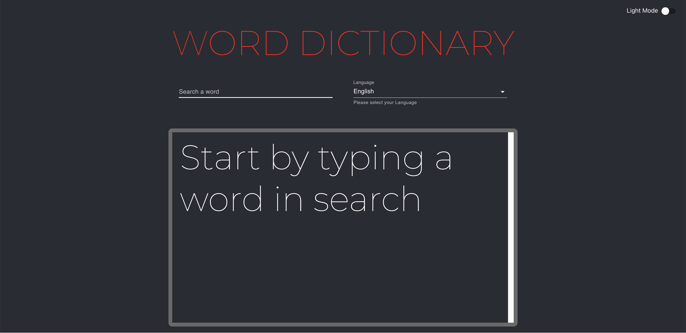

# Dictionary App

Below is a screenshot of the App

## About the App

- This app is a dictionary app, that allows the user to search for any word and find out all of its possible definitions.

- The app retrives the data from https://dictionaryapi.dev.

- The front end is developed in react and the retrival of the data is developed by using Axios to make a get request to the above api.

- The application components included Definitions and Header. 

- Added functionality for Dark/Light mode.

## Link to app

The app is deployed on Heroku and can be reached via the below link:

